## Credits
> Forked (ported) from https://github.com/gwintzer/transform_vis and https://github.com/bjacomy/transform_vis* - Special thanks to these contributors who kept and are still keeping this plugin working for all Kibana versions.

## Transform plugin

An Opensearch visualization plugin that allows arbitrary queries results to be processed by a [Mustache](https://mustache.github.io/) transform.
You can also call any external JS library to build new visualisations: Google Chart, d3js, Apache Echart...

**[See OpenSearch Community Projects](https://opensearch.org/community_projects)**

* [Prerequisites](#prerequisites)
* [Installation](#installation)
* [Plugin presentation](#plugin-presentation)
* [Visualisation samples](#visualisation-samples)

## Prerequisites

### OpenSearch Dashboards

#### Client side

On the OpenSearch Dashboards client side (**Stack Management > Advanced Settings**), enable the `state:storeInSessionStorage` option in order to avoid the following error message: *"The URL for this object is too long, and we can't display it"*.

#### Server side

By default, no unsafe HTML (such as `<style>` tags) will be allowed, but Javascript processing can be achieved by acknowledging the client-side security risk in `opensearch_dashboards.yml`. 
Morevover, access to external libraries can also be allowed by adding the required root URLs in the configuration (the list given below is not exhaustive). 

Add the following lines into your `opensearch_dashboards.yml` file: 

```sh
# server.cors: true is normally the default value but required in case you you need to access Opensearch from JS code (e.g. XHR requests) along with the opensearch configuration next section.
server.cors: true

csp.strict: false
csp.warnLegacyBrowsers: false
csp.rules:
  - "script-src 'unsafe-eval' 'unsafe-inline' https://www.gstatic.com/ https://d3js.org/ https://cdn.jsdelivr.net/ https://cdnjs.cloudflare.com/ https://cdn.datatables.net/ 'self'
  - "worker-src blob: *"
  - "child-src data: * blob: *"
```

### OpenSearch (optional)

The configuration for Opensearch (server side) in only required in case you need to access Opensearch from JS code (e.g. XHR requests).

Add the following lines into your `opensearch.yml` file:

```sh
http.cors.enabled : true
http.cors.allow-origin: "*"
http.cors.allow-methods : OPTIONS, HEAD, GET, POST, PUT, DELETE
http.cors.allow-headers: "kbn-version, Origin, X-Requested-With, Content-Type, Accept, Engaged-Auth-Token Authorization"
```

## Installation

The installation command is given for version `1.1.0`:

```sh
bin/opensearch-dashboards-plugin install https://github.com/lguillaud/osd_transform_vis/releases/download/1.1.0/transformVis-1.1.0.zip
```

By running this command, a new visualization `transform` will be available when using the Visualize module in OpenSearch Dashboards.

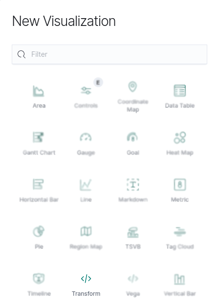

## Plugin presentation

The plugin is split into 2 parts:

* a development window with 3 different tabs: Multi Query DSL, Javascript and Template
* a visualisation window

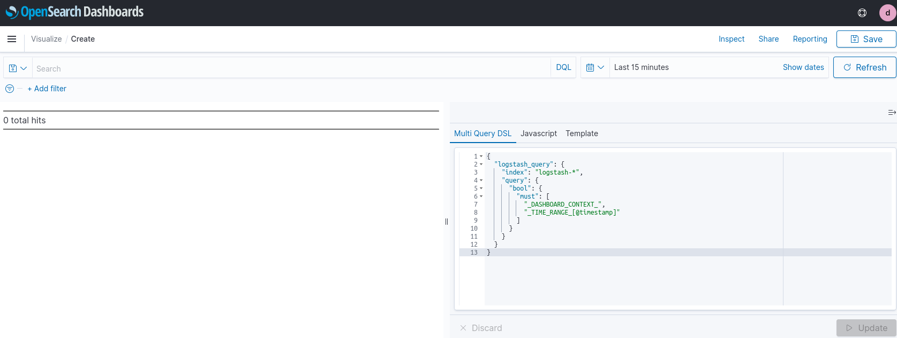

### Basic usage

The object passed to the mustache template looks like this:

```sh
{
  response: { .. } // The Query Response exactly as returned from OpenSearch
  context: { .. } // The dashboard context (contains filters, query string, time range)
  meta: { .. } // Your Javascript Object
}
```

From mustache, you can access these variables directly.
From the Javascript object, they are available via `this`, e.g., `this.response`.

`<script>` tags will not be evaluated.  

Any Javascript given will be executed by the web browser, however in order to be merged with the query response object for processing by Mustache, you must prepare an Object, enclosed by parentheses.


Functions called by mustache are executed before the actual render on the page, so no DOM manipulation can be done.   
The `before_render` and `after_render` lifecycle hooks will be called automatically. The former can be used for any pre-processing that might be required before rendering, and the latter should be used for anything that expects the HTML to be rendered.


### Example to display single value

Javascript
```sh
({
 some_var: 42,
 count_hits: function() {
  return this.response.hits.total;
 }
})
```

Template
Named functions can then be called by mustache, like:
```
<hr>{{meta.count_hits}} total hits<hr>
```

### Example to display Bootstrap table

Multi Query DSL
```
{
  "sample": {
    "index": "opensearch_dashboards_sample_data_ecommerce",
    "query": {
      "bool": {
        "must": [
          "_DASHBOARD_CONTEXT_",
          "_TIME_RANGE_[order_date]"
        ]
      }
    },
    "aggs": {
      "customer": {
        "terms": {
          "field": "customer_full_name.keyword",
            "size": 5
        }
      }
    }
  }
}
```

Javascript 
```
({
  ecommerce: function() {
    return this.response.sample.aggregations.customer.buckets;
  }
})
```

Template
```
<link rel="stylesheet" href="https://maxcdn.bootstrapcdn.com/bootstrap/4.0.0/css/bootstrap.min.css" integrity="sha384-Gn5384xqQ1aoWXA+058RXPxPg6fy4IWvTNh0E263XmFcJlSAwiGgFAW/dAiS6JXm" crossorigin="anonymous">

<h2>List of best buyers from response</h2>
<table class="table caption-top">
  <thead>
    <tr>
      <th scope="col">Full name</th>
      <th scope="col">Number or orders</th>
    </tr>
  </thead>
  <tbody>
    {{#response.sample.aggregations.customer.buckets}} 
    <tr>
      <th scope="row">{{key}}</th>
      <td>{{doc_count}}</td>
    </tr>
    {{/response.sample.aggregations.customer.buckets}} 
    </tbody>
</table>

<h2>List of best buyers from function</h2>
<table class="table caption-top">
  <thead>
    <tr>
      <th scope="col">Full name</th>
      <th scope="col">Number or orders</th>
    </tr>
  </thead> 
  <tbody>
    {{#meta.ecommerce}} 
    <tr>
      <th scope="row">{{key}}</th>
      <td>{{doc_count}}</td>
    </tr>
    {{/meta.ecommerce}} 
    </tbody>
</table>
```

Result
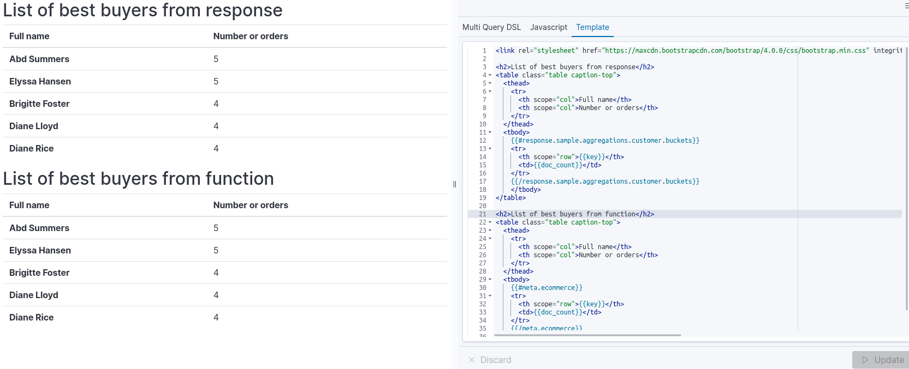

#### Support for CSS

`<style>` tags can be embedded in the mustache template.

Another to load css files is to use a JS function (e.g. for FontAwesome):

Javascript

```sh
css: function() {  
      const css_list = ["https://use.fontawesome.com/releases/v5.6.3/css/all.css"];  
      for (let css_file of css_list) {
          const links = document.head.querySelectorAll("link");

          // Already been injected
          for(let l in links)
            if(links[l].href == css_file) return;
            const link = document.createElement('link');
            link.rel = "stylesheet";
            link.href = css_file;
            document.head.appendChild(link);
        } 
}
```

#### Query DSL

`"_DASHBOARD_CONTEXT_"`, including the surrounding quotes, will be replaced by a bool query that represents the filter/search state of the dashboard in context.  
`"_TIME_RANGE_[<date field name>]" ` , including the surrounding quotes, will be replaced by a date range query that represents the date/time filter state of the dashboard in context.

It is allowed to use multiple named queries.

This example is given to demonstrate how the dashboard context can co-exist with your own query clauses, but you are not restricted to this format.

The following code produces multi-level bool statement:

Query DSL
```
{
  	"ordersPerDay": {
   		"index": "opensearch_dashboards_sample_data_ecommerce",
 		"query": {
			"bool": {
   				"must": [
	    			"_DASHBOARD_CONTEXT_",
     				"_TIME_RANGE_[order_date]"
     				.. your must clause(s) can go here ..
   				], 
   				"should": [
	     		.. your should clause(s) can go here ..
   				]
  			}
 		}
	}
```

#### Debugging

You can dump the response object to a `<pre>` tag in your visualization output while testing, for convenience.

Javascript
```
({
 count_hits: function() {
  return this.response.hits.hits.length;
 },
 debug: function() {
  return JSON.stringify(this, null, ' ');
 } 
})
```

Template

```
<hr>
  {{response.hits.total}} total hits<BR>
  {{meta.count_hits}} returned hits<BR>
<hr>

<pre>
{{meta.debug}}
</pre>
```
### Advanced usage

The transform plugin makes use of a shadow DOM for the visualisation. This DOM is located below the div of which id is `output-vis`. 
Shadow DOM is a DOM feature that helps you build components. You can think of shadow DOM as a scoped subtree inside your element. See [here](https://polymer-library.polymer-project.org/2.0/docs/devguide/shadow-dom) for more details.
We then use [the shadowRoot command](https://developer.mozilla.org/en-US/docs/Web/API/Element/shadowRoot) in order to access the shadow DOM and manipulate it.

This DOM will be used when you need to change the DOM from the javascript window which will be the case when using external librairies for visualisations (e.g. Google Chart): in that specific case, you should be using the `after_render` lifecycle hook.
When used in an OpenSearch Dashboard dashboard, we need to make sure we access the right shadow DOM in the case we have multiple transform visualisations. Make sure to always use unique IDs for HTML tag.

To do so, here are the javascript lines in charge of getting the right DOM. In this example, we need to find out where the `viz` ID is located in the shadow DOM in order to pass the location to the D3js function.
A dedicated function will be used to retrieve the shadow DOM information.

Javascript
```sh
({
getShadowDomLocation: function(selector) {
  let vizLocation;
  // output-viz being the top selector used by the Transform plugin
  // Get all the output-viz elements (can have mutliple selector if multiple transfrm vizs in a dashboard)
  // selector parameter value must be unque within the DOM
  const elements = $('.output-vis');
  let shadow;
  for (let elem of elements) {
      shadow = elem.shadowRoot;
      vizLocation = $(shadow).find(selector);
      if (vizLocation.length > 0) {
      // selector found, exiting
        break;
      } else {
        vizLocation = '.notFound';
      }
  } 
  const obj = {
    vizLocation: vizLocation,
    shadowRoot: shadow
    }
// obj object contains the shadowRoot element and and the location of the selector within the shadowRoot
  return obj;
},

after_render: function() {
  // Save this.meta Object for further use
  // Will be used to call the getShadowDomLocation function
  const meta = this.meta;
  
  function displayCircle() {
    // Get shadow DOM
    let ctxRadar = meta.getShadowDomLocation("#viz").vizLocation[0];
    
    // Clear ctxRadar to avoid multiple circles
    $(ctxRadar).empty();
    
    let sampleSVG = d3.select(ctxRadar)
      .append("svg")
      .attr("width", 100)
      .attr("height", 100);    
    
    sampleSVG.append("circle") 
      .style("stroke", "gray")  
      .style("fill", "white")
      .attr("r", 40)
      .attr("cx", 50)
      .attr("cy", 50)
      .on("mouseover", function(){d3.select(this).style("fill", "aliceblue");})
      .on("mouseout", function(){d3.select(this).style("fill", "white");});
  }
  
  $.getScript("https://d3js.org/d3.v3.min.js")
    .done(function(script, textStatus) {
      displayCircle();
  });

}
}) 
```

Template
```
<div id="viz"> </div>
```


## Visualisation samples

A new directory sample_vizs is now available with the following visualisations:

* sample_decisionTree.ndjson: Decision tree with D3js lib (https://fractalytics.io/visualization-scikit-learn-decision-trees-d3-js)
* sample_googleChartGauge.ndjson: Gauge with Google Chart (requires sample data `opensearch_dashboards_sample_data_ecommerce`). Also need to change time filter to "Last 1 year" as set to "last 15 minutes" by default, otherwise you will get an *Error (See Console)* on the visualisation window. 
* sample_googleChartScatterAndControlIframe.ndjson: Scatter chart with Goofle Chart byt using Iframe (might be required in a few cases when there are JS librairies conflicts)
* sample_sankey.ndjson: Sankey with D3js lib (https://www.d3-graph-gallery.com/graph/sankey_basic.html)
* sample_saveCSVToOpensearch.ndjson: Import CSV file into an OpenSearch index 
* sample_map_openstreetmap_leaflet.ndjson: Openstreetmap with leaflet
* sample_map_openstreetmap_leaflet_custom_geojson.ndjson: Openstreetmap with leaflet and custom GeoJSON layer (french departments)
* sample_boostedOrangeSampleIframe.ndjson: sample accordion component from Orange Boosted (within Iframe) (https://boosted.orange.com/)
* sample_sankey_with_apache_echart.ndjson: sample sankey using the Apache Echart library (https://echarts.apache.org/examples/en/editor.html?c=sankey-levels)

**How to load ndjson files ?** Open OpenSearch Dashboards > Stack Management > Saved Objects > Import > Select ndjson file to import > Click Import

**How to open the samples once loaded ?** Open OpenSearch Dashboards > Visualize > Click on the visualization you just imported

> Note: Most of the examples do not have a query to get data from Opensearch as data used are hardcoded in the Javascript part but you might need to import sample data for some visualisations.

To import sample data: go to OpenSearch Dashboards > Click on the logo on the top left corner > Ingest your data > Add data > Choose sample data to add and click `Add Data`.

###  Decision tree

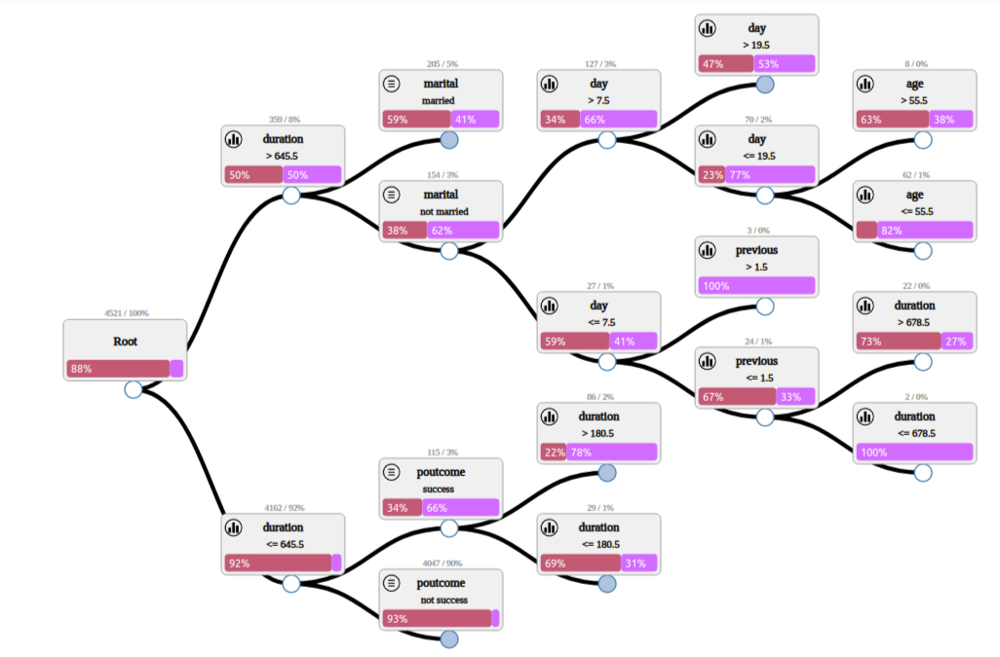

### Gauge

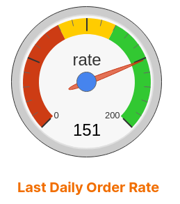

### Scatter chart and control

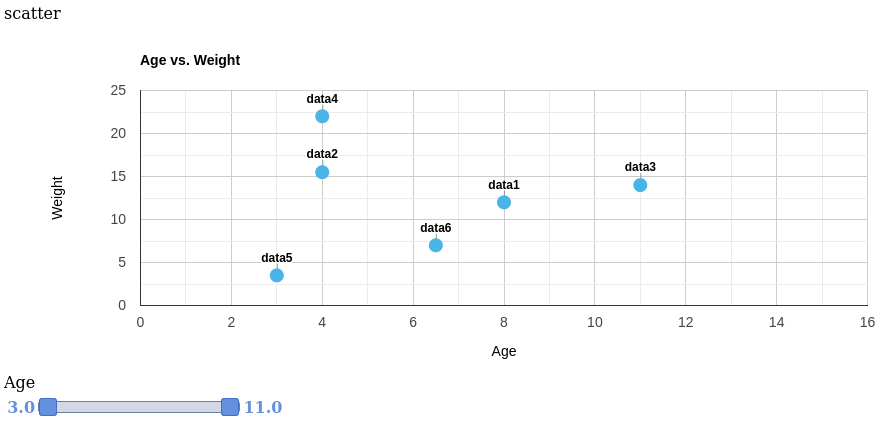

### Sankey

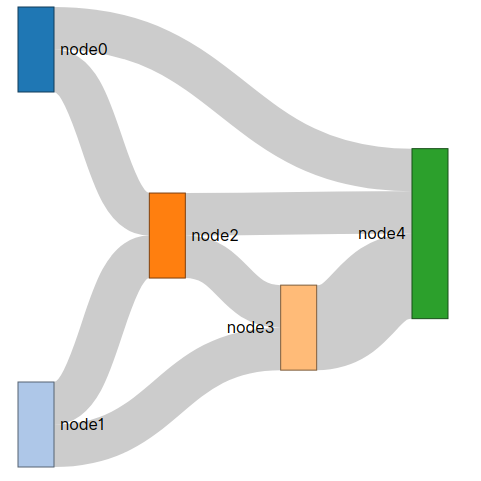

### CSV import (pure JS)
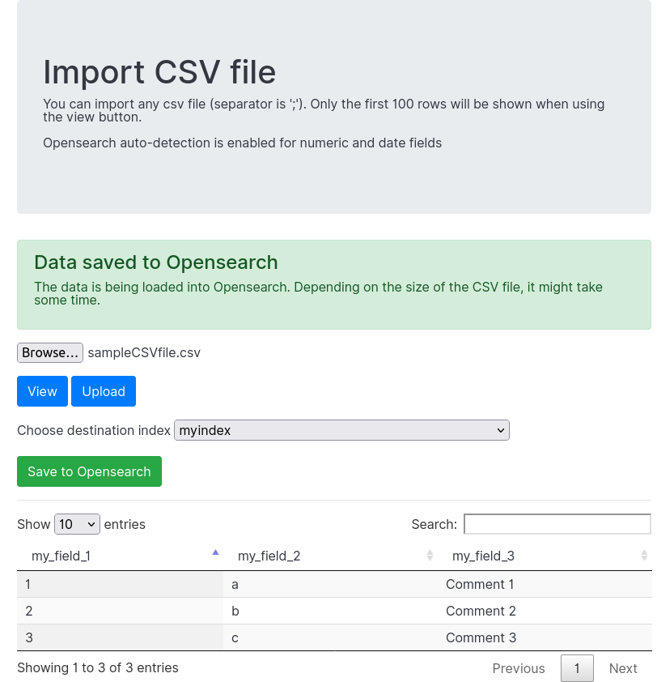

### Openstreetmap
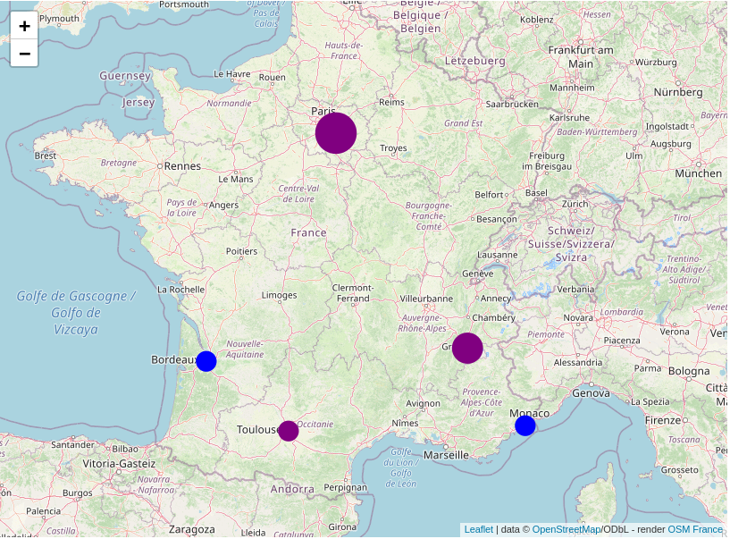

### Openstreetmap with custom GeoJSON layer


### Boosted sample
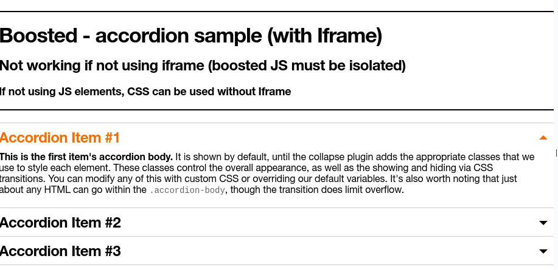

### Apache Echart Sankey sample
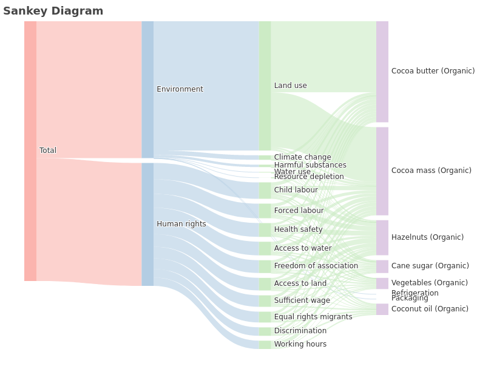
